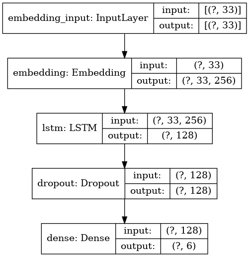
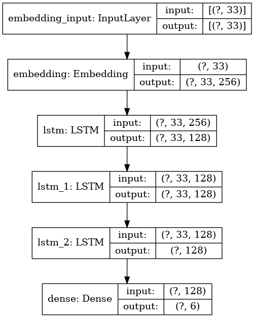

= LSTM model

== Preprocessing

* Vectorize
* Pad

=== Data

Test and Train data are separated

== Models

=== Simple LSTM model

=== Double LSTM layers model

image::../models/LSTM2_DENSE_2.png[alt="LSTM2_DENSE_2"]

=== Triple LSTM layers model

